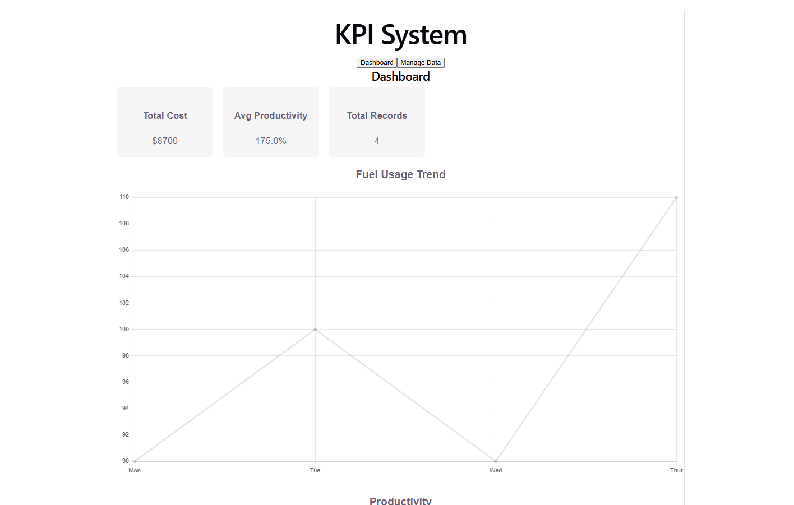
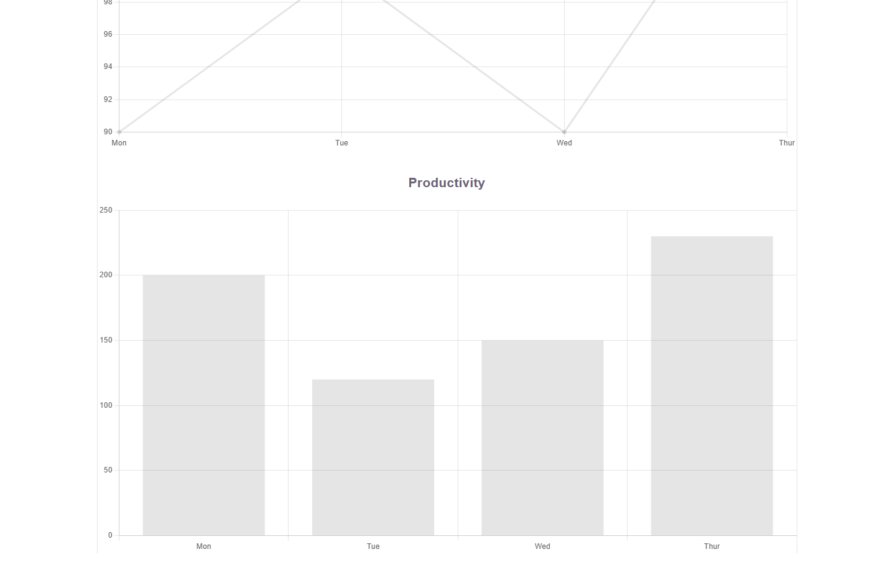
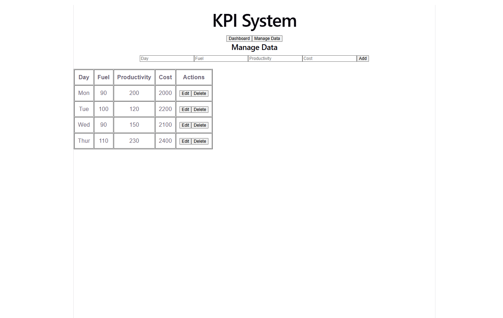

# KPI Dashboard (Full Stack)

# Screen Shot
- Dashboard 

- Manage data

## Features
- Interactive dashboard with charts
- CRUD operations (Create, Read, Update, Delete)
- Inline editable table
- RESTful API with Flask
- PostgreSQL database integration

## Tech Stack
- React
- Flask
- PostgreSQL
- Chart.js

## Setup

### Backend
cd backend
pip install -r requirements.txt
python app.py
Set environment variable DB_PASSWORD

### Frontend
cd frontend
npm install
npm run dev

## Highlights
- Component-based architecture
- Inline editing UX
- API integration with state management

## Future Improvements
- Add authentication
- Deploy to cloud
- Add filtering & pagination